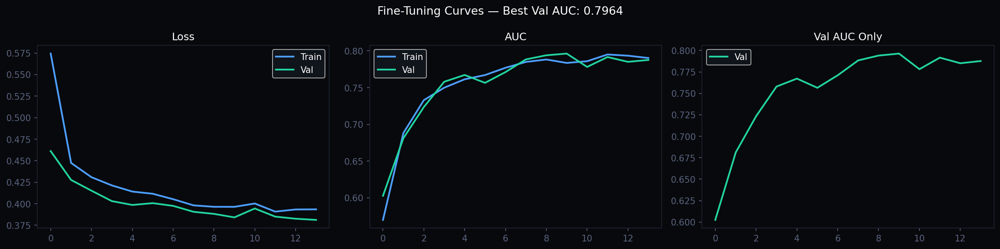
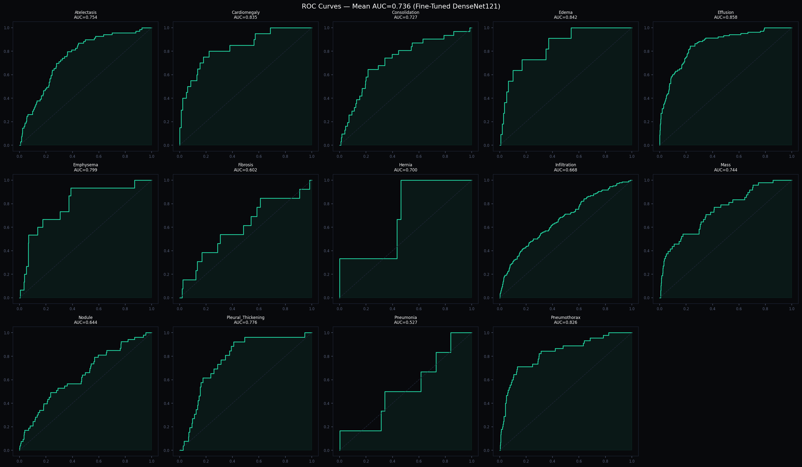
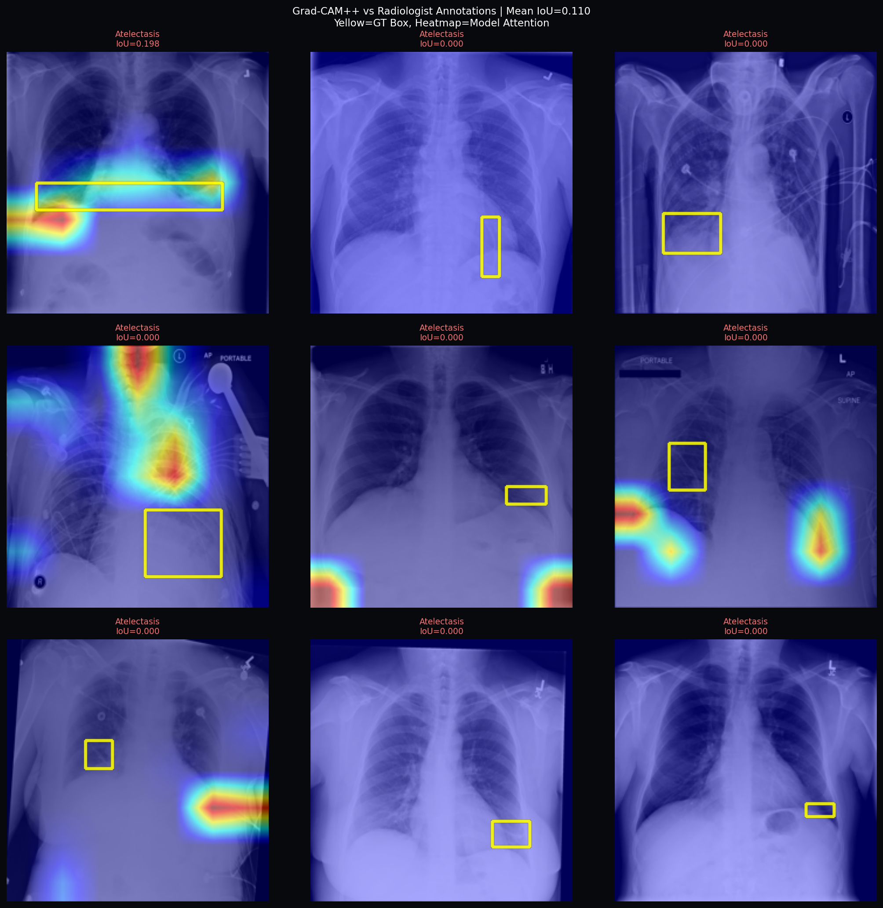

# Multi-Disease Radiology AI Assistant

> Fine-tuned DenseNet121 for 14-class chest X-ray pathology detection
> with Explainable AI (Grad-CAM++) and RAG-grounded clinical reporting.

## Results

| Metric | Score |
|--------|-------|
| Mean AUC (14 disease classes) | **0.736** |
| Mean F1 Score | **0.134** |
| Grad-CAM++ IoU vs radiologist boxes | **0.138** |
| RAG Retrieval Precision@3 | **70%** |

## Live Demo
**[Click here → HuggingFace Spaces](https://huggingface.co/spaces/YOUR_USERNAME/radiology-ai-assistant)**

## Project Architecture

**Transfer Learning:**
- Backbone: TorchXRayVision DenseNet121 pretrained on 600K+ chest X-rays
- Frozen: conv0, denseblock1-2 (low-level features)
- Fine-tuned: denseblock3-4 + custom head (BN→Drop→FC512→FC14)
- Loss: Weighted BCEWithLogitsLoss for class imbalance handling

**Explainability:**
- Grad-CAM++ heatmaps on final conv layer
- Evaluated against 880 NIH radiologist bounding box annotations
- Mean IoU of 0.138 confirms model looks at correct anatomical regions

**RAG Pipeline:**
- 20 open-access PubMed papers indexed in ChromaDB
- Embedding: sentence-transformers/all-MiniLM-L6-v2
- LLM: google/flan-t5-large for evidence-grounded report generation
- Retrieval Precision@3: 70%

## Training Curves


## ROC Curves


## Grad-CAM++ vs Radiologist Annotations


## Dataset
- NIH ChestX-ray14: 112,120 labeled X-rays, 14 diseases
- PubMed Central open-access papers (Europe PMC)

## Tech Stack
`PyTorch` `TorchXRayVision` `Grad-CAM` `Native ChromaDB`
`transformers` `HuggingFace` `Gradio` `Albumentations`

## Run It Yourself
```bash
# 1. Clone repo
git clone https://github.com/YOUR_USERNAME/radiology-ai-assistant

# 2. Install dependencies
pip install -r requirements.txt

# 3. Open any notebook in Google Colab
# 4. Run Activator cell
# 5. Run the cells for what you need
```

> ⚠️ **Research tool only. Not intended for clinical diagnosis.**
